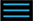
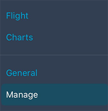
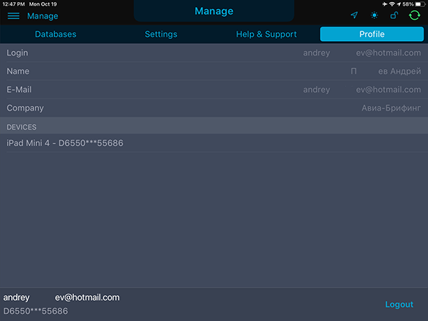

### 3. Профиль пользователя

Для просмотра профиля пользователя необходимо выйти в главное меню приложения. Для этого нажмите в левом верхнем углу кнопку меню  .

В открывшемся окне выберите раздел «Manage».

Вверху доступна панель с основными вкладками раздела:

- Databases
- Settings
- Help & Support
- Profile

Просмотр данных пользователя доступен во вкладке Profile.

В данном окне также осуществляется управление привязанными устройствами.

Чтобы выйти из своего аккаунта, нажмите кнопку «Logout», расположенную в правом нижнем углу.