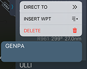
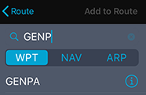

### 10. Редактирование маршрута

Редактирование маршрута осуществляется в боковой панели во вкладке « Route».

Удерживайте строку с наименованием ППМ и в появившемся дополнительном меню выберите действие:

- Direct to (для спрямления)
- Insert wpt (для добавления ППМ после выбранного)
- Delete (для удаления выбранного ППМ)

Если необходимо добавить ППМ после выбранного нажмите Insert wpt. В появившемся окне в строке поиска введите наименование нужного ППМ, а затем нажмите кнопку Add to Route.

