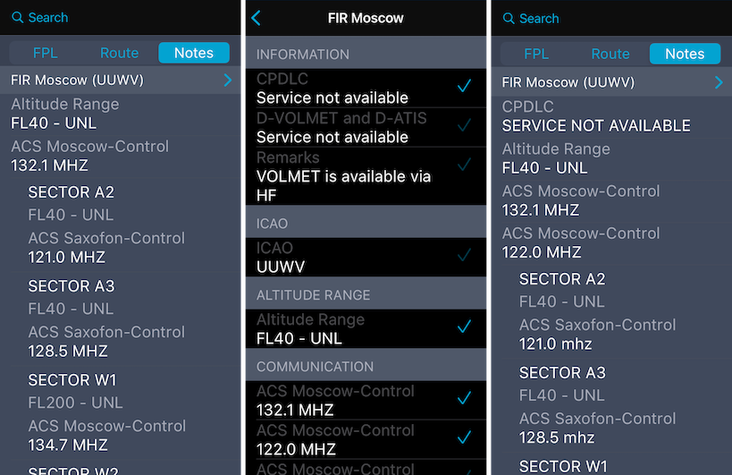

### 11. Просмотр информации по маршруту в панели "Flight Notes"

В панели Flight Notes представлена информация, касающаяся аэродромов вылета и назначения, также представлены данные для работы с органами ОВД по маршруту (частоты для связи, границы контролируемого воздушного пространства итд.)

**ВНИМАНИЕ!** Информация по маршруту в панели Flight Notes доступна только после завершения прокладки маршрута.

В панели Flight Notes доступен просмотр метеоинформации для аэродромов вылета и назначения, а также просмотр действующих NOTAM.

Данные которые отображаются в панели Flight Notes настраиваются. Например, можно изменить частоту радиообмена с органом ОВД или добавить заметку с информацией о РПИ. Чтобы редактировать отображаемую информацию в панели FN необходимо нажать на синюю стрелку - 

Затем, в появившемся окне, поставить галочки напротив той информации, которую необходимо отобразить в панели.

