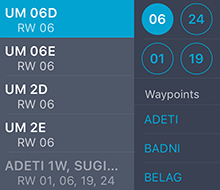
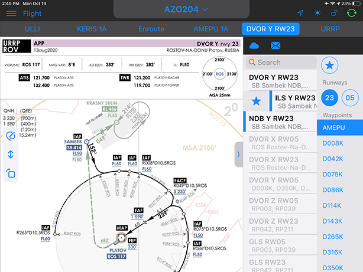
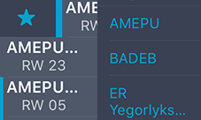
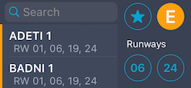

### 12. Просмотр процедур маневрирования

Процедуры маневрирования в районе аэродрома доступны в разделах «Flight» и «Charts». В разделе «Flight» в верхней части экрана располагается панель, которая отражает ход выполнения полета от аэродрома вылета до аэродрома назначения. Во вкладке с кодом аэродрома доступны схемы руления (TAXI), справочная информация по аэродрому (GEN), а также метеоинформация и NOTAM.

Вкладки SID, STAR и APP изменяют свое название в зависимости от выбора соответствующей процедуры. Для удобного поиска процедур можно использовать панель фильтрации.

В панели фильтрации доступно два типа сортировки: По ВПП, которой принадлежит процедура, а также по контрольной точке, идентифицирующей процедуру. Процедуры удовлетворяющие условиям сортировки оказываются вверху списка, а те карт-схемы, которые не удовлетворяют им становятся неактивны.

В разделах «Charts» и «Flight» доступна панель настройки отображения карт-схемы, а также панель рисования.

Лист с процедурой можно отобразить на всю ширину окна или расположить так, чтобы ее было видно целиком. Также, можно перевернуть карт-схему.

В панели рисования пользователь может настраивать толщину и цвет линии, удалять нарисованное и возвращаться в предыдущему рисунку.

Чтобы добавить схему в избранное используйте правый свайп по строке с названием процедуры. Добавленные в избранное процедуры можно удобно отображать при помощи кнопки избранного - .

Просмотр процедур маневрирования, а также справочной информации по другим аэродромам доступен в разделе «Charts».

Процедуры полета в аварийной ситуации маркированы вертикальной оранжевой чертой. Чтобы отсортировать процедуры полета в аварийной ситуации необходимо нажать на кнопку Emergency, расположенную в правом

верхнем углу - .

Просмотр процедур маневрирования, а также справочной информации по другим аэродромам доступен в разделе «Charts».

