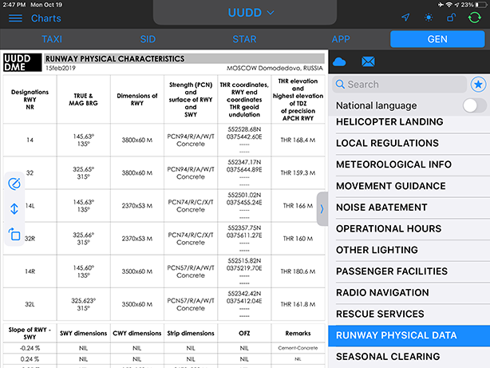

### 13. Справочная информация по аэродрому

Справочная информация по аэродрому содержит сведения о располагаемых дистанциях, несущей способности покрытия, огнях подхода, посадочных огнях, времени работы аэродрома и другую информацию, имеющую важное значение для выполнения полета.

Справочная информация по аэродрому доступна в разделах « Flight» и « Charts».

Чтобы перейти к справочной информации по аэродрому из раздела «Flight» , необходимо перейти во вкладку с кодом аэродрома (в разделе «Flight» доступен аэродром вылета и аэродром назначения), а затем переключиться с TAXI на GEN в верхней части боковой панели.

Для перехода к справочной информации по аэродрому из раздела «Charts» , достаточно выбрать аэродром в верхней части окна, а затем перейти во вкладку GEN.

