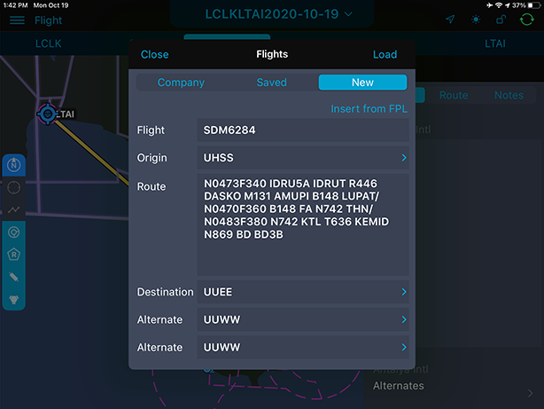

### 8. Прокладка маршрута с помощью "Clipboard"

Если у вас есть ATC flight plan в формате ICAO, скопируйте его в буфер обмена.

Затем, перейдите в раздел «Flight» и в верхней части экрана нажмите кнопку Tap to select or create flight. Выберите вкладку New и затем нажмите Insert from FPL. Соответствующие поля в разделе заполнятся автоматически. Для завершения прокладки маршрута нажмите кнопку Load, в правом верхнем углу.

**ВНИМАНИЕ!** В случае неправильного формата FPL или ошибки копирования, в правом верхнем углу появится надпись «No FPL found»

