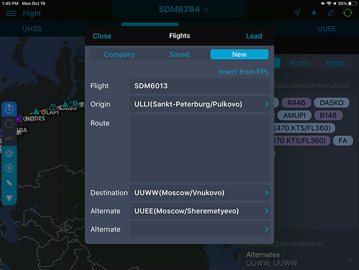
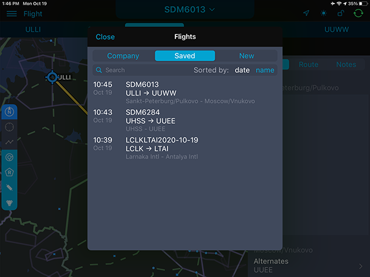

### 9. Ручная прокладка маршрута

В разделе «Flight» доступна ручная прокладка маршрута.

После нажатия Tap to select or create flight во всплывающем окне выберите вкладку New, заполните соответствующие поля и нажмите кнопку Load. Линия пути отобразится на карте автоматически.

Во вкладке Saved можно просмотреть и выбрать один из сохраненных маршрутов.

Для редактирования маршрута используйте боковую панель.

