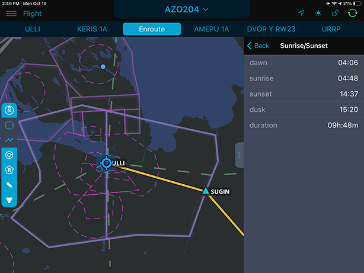

### 15. Просмотр информации о моментах естественного освещения

Календарь с информацией о моментах естественного освещения позволяет получить данные о времени восхода и захода солнца, времени рассвета и наступления темноты, а также о продолжительности дня.

Для доступа к календарю необходимо выбрать аэродром или ППМ, а затем перейти во вкладку sunrise/sunset  .

