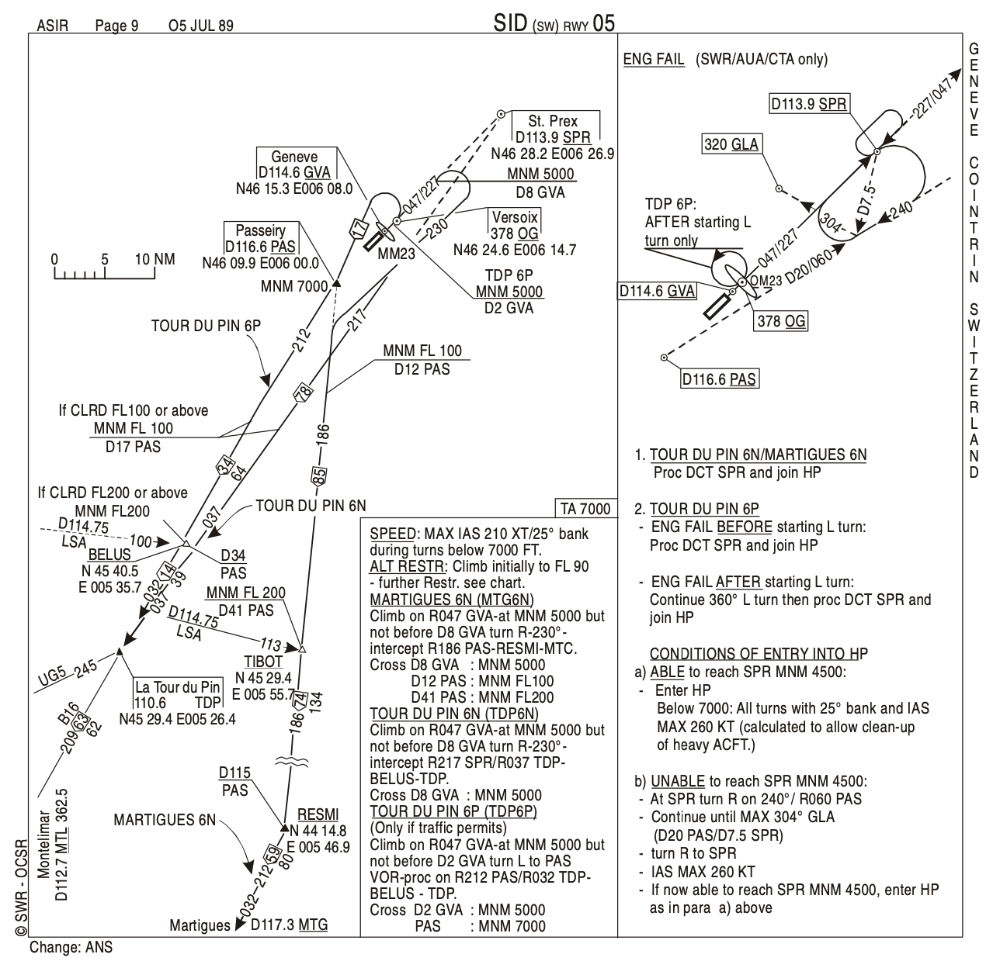
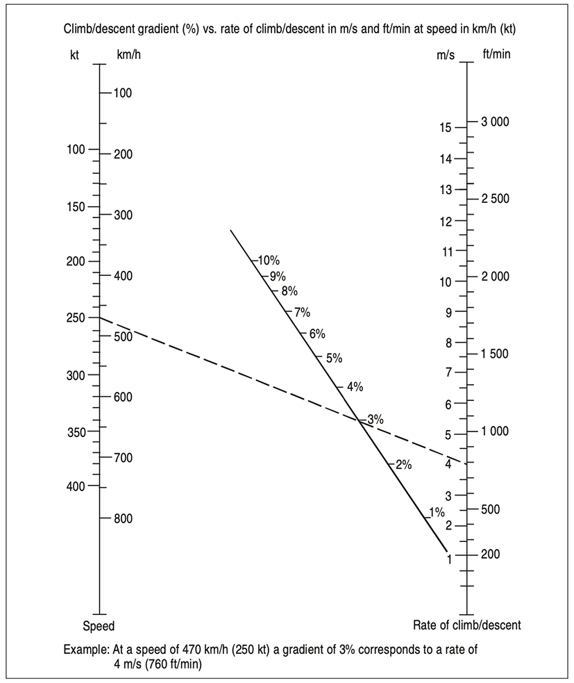

### DEPARTURE PROCEDURES (General criteria)

#### 1. Introduction

The criteria in this section are designed to provide flight crews and other flight operations personnel with an appreciation, from the operational point of view, of the parameters and criteria used in the design of instrument departure procedures. These include, but are not limited to, standard instrument departure (SID) routes and associated procedures.

These procedures assume that all engines are operating. In order to ensure acceptable clearance above obstacles during the departure phase, instrument departure procedures may be published as specific routes to be followed or as omnidirectional departures, together with procedure design gradients and details of significant obstacles.

#### 2. Operator responsobility

Development of **contingency procedures**, required to cover the case of engine failure or an emergency in flight which occurs after V1, is the responsibility of the operator, in accordance with Annex 6. An example of such a procedure, developed by one operator for a particular runway and aircraft type(s), is shown in Figure-1 below. Where terrain and obstacles permit, these procedures should follow the normal departure route.

*Fig.1 - Contingency procedure example*

When it is necessary to develop **a turning procedure** to avoid an obstacle which would have become limiting, then the procedure should be described in detail in the appropriate operator’s manual. The point for start of turn in this procedure must be readily identifiable by the pilot when flying under instrument conditions.

The use of **automatic take-off thrust control systems (ATTCS)** and noise abatement proceduresneeds to be taken into consideration by the pilot and the operator.

#### 3. Instrument Departure Procedure

**The design of an instrument departure procedure** is, in general, dictated by the terrain surrounding the aerodrome. It may also be required to provide for air traffic control (ATC) requirements in the case of SID routes. These factors in turn influence the type and siting of navigation aids in relation to the departure route. Airspace restrictions may also affect the routing and siting of navigation aids.

At many aerodromes, **a prescribed departure route** is not required for ATC purposes. Nevertheless, there may be obstacles in the vicinity of some aerodromes that have to be considered in determining whether restrictions to departures are to be prescribed. In such cases, departure procedures may be restricted to a given sector(s) or may be published with a procedure design gradient in the sector containing the obstacle.

Where no suitable navigation aid is available, the criteria for **omnidirectional departures** are applied. 
*****Omnidirectional departures may specify sectors to be avoided.

Where obstacles cannot be cleared by the appropriate margin when the aeroplane is flown on instruments, **aerodrome operating minima** are established to permit visual flight clear of obstacles. 
Wherever possible, a straight departure is specified which is aligned with the runway centre line. 
When a departure route requires a turn of more than 15° to avoid an obstacle, a turning departure is constructed.

**A departure procedure is established for** each runway where instrument departures are expected to be used. It will include procedures for the various categories of aircraft.

The procedures assume that pilots will not compensate for **wind effects** when being radar vectored. They also assume that pilots will compensate for known or estimated wind effects when flying departure routes which are expressed as tracks to be made good.

#### 4. Obstacle clearance

The minimum obstacle clearance equals zero at the departure end of the runway (DER). From that point, it increases by 0.8 per cent of the horizontal distance in the direction of flight assuming a maximum turn of 15°.
In the turn initiation area and turn area, a minimum obstacle clearance of 90 m (295 ft) is provided. 
Where precipitous and mountainous terrain exist, consideration is given by the procedures designer to **increasing the minimum obstacle clearance**.

#### 5. Procedure design gradient (PDG)

The procedure design gradient (PDG) is intended as an aid to the procedures designer, who adjusts the route with the intention of minimizing the PDG consistent with other constraints. 
Unless otherwise published, a PDG of 3.3 per cent is assumed. 
The PDG is not intended as an operational limitation for those operators who assess departure obstacles in relation to aircraft performance, taking into account the availability of appropriate ground/airborne equipment.

**The PDG is based on:**

a) an obstacle identification surface (OIS) having a 2.5 per cent gradient or a gradient determined by the most critical obstacle penetrating the surface, whichever is the higher (see Figure 2); and

b) an additional margin of 0.8 per cent.

*Fig.2 - Departure gradient*

**Published gradients are specified to** an altitude/height after which the minimum gradient of 3.3 per cent is considered to prevail (see the controlling obstacle in Figure 2). For conversion of climb gradient for cockpit use, see Figure 3. 
The final PDG continues until obstacle clearance is ensured for the next phase of flight (i.e. en-route, holding or approach). At this point, the departure procedure ends and is marked by a significant point.

Fig.3 - *Conversion nomogram*

#### 6. Fixes as an aid in obstacle avoidance

Whenever a suitably located DME exists, additional specific height/distance information intended for obstacle avoidance may be published. RNAV waypoint or other suitable fixes may be used to provide a means of monitoring climb performance.

#### 7. Radar vectors

Pilots should not accept radar vectors during departure unless:

a) they are above the minimum altitude(s)/height(s) required to maintain obstacle clearance in the event of engine failure. This relates to engine failure between V1 and minimum sector altitude or the end of the contingency procedure as appropriate; or 
b) the departure route is non-critical with respect to obstacle clearance.