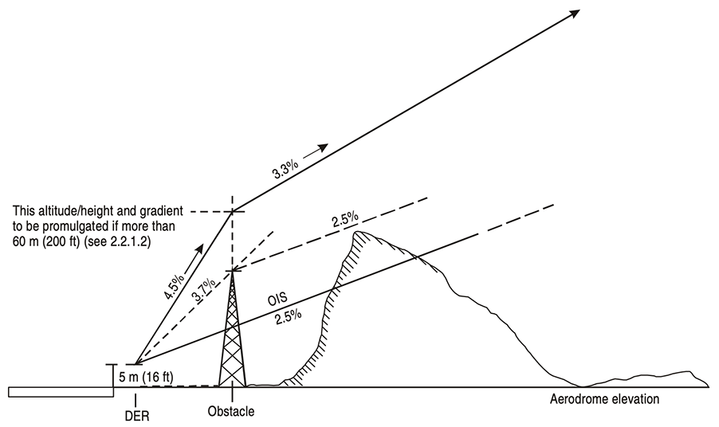

### **STANDARD INSTRUMENT DEPARTURE (SID)**

#### 1. General

A standard instrument departure (SID) is a departure procedure that is normally developed to accommodate as many aircraft categories as possible. Departures that are limited to specific aircraft categories are clearly annotated.

The **SID terminates** at the first fix/facility/waypoint of the en-route phase following the departure procedure.

There are two basic **types of SID:** straight departures and turning departures. SIDs are based on track guidance acquired:

​	a) within 20.0 km (10.8 NM) from the departure end of the runway (DER) on straight departures; and 

​	b) within 10.0 km (5.4 NM) after completion of turns on departures requiring turns.

Track guidance may be provided by a suitably located facility (VOR or NDB) or by RNAV.

#### 2. Straight departures

A straight departure is one in which the initial departure track is within 15° of the alignment of the runway centre line.

When obstacles exist which affect the departure route, procedure design gradients (PDGs) greater than 3.3 per cent may be specified. When such a gradient is specified, the altitude/height to which it extends shall be promulgated. After this point, the PDG of 3.3 per cent (Category H, 5.0 per cent) resumes.

Gradients to a height of 60 m (200 ft) or less, caused by close-in obstacles, are not specified. A note will be published stating that the close-in obstacles exist. See fig. 1.

*Fig.1 - Procedure design gradient*

#### 3. Turning departures

When a departure route requires a turn of more than 15°, it is called a turning departure. Straight flight is assumed until reaching an altitude/height of at least 120 m (394 ft), or 90 m (295 ft) for helicopters. Procedures normally cater for turns at a point 600 m from the beginning of the runway. However, in some cases turns may not be initiated before the DER (or a specified point), and this information will be noted on the departure chart.

For Category H procedures, procedure turns can be initiated 90 m (295 ft) above the elevation if the DER and the earliest initiation point are at the beginning of the runway/final approach and take-off area (FATO).

No provision is made in this document for turning departures requiring a turn below 120 m (394 ft) (90 m (295 ft) for helicopters) above the elevation of the DER.

Where the location and/or height of obstacles preclude(s) the construction of turning departures which satisfy the minimum turn height criterion, departure procedures should be developed by the competent authority in consultation with the operators concerned.

**Turns may be defined** as occurring at:

a) an altitude/height; and

b) a fix or facility.

**The speeds** used are those of the final missed approach increased by 10 per cent to account for increased aeroplane mass in departure (see Table 1).

In exceptional cases, where acceptable terrain clearances cannot otherwise be provided, turning departure routes are constructed with maximum speeds as low as the intermediate missed approach speed increased by 10 per cent. In such cases, the procedure is annotated “Departure turn limited to _____________km/h (kt) IAS maximum”.

| Aeroplane category | Maximum speed km/h (kt) |
| :----------------: | :---------------------: |
|         A          |        225 (120)        |
|         B          |        305 (165)        |
|         C          |        490 (265)        |
|         D          |        540 (290)        |
|         E          |        560 (300)        |
|         H          |        165 (90)         |

*Table-1. Maximum speeds for turning departures*

