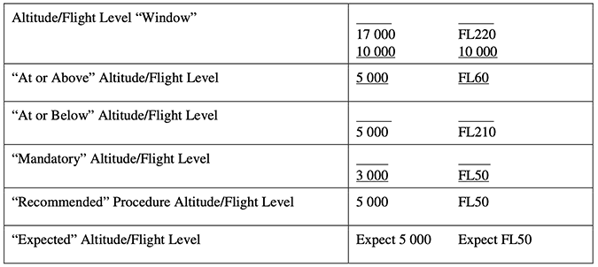

### PUBLISHED INFORMATION FOR DEPARTURES

#### 1. General

When it is necessary, after a turn, to fly a heading to intercept a specified radial/bearing, the procedure will specify:

- Tthe turning point;

- The track to be made good; and

- The radial/bearing to be intercepted.

**Example**: “at DME 4 km turn left to track 340° to intercept VOR R020”; or “at DME 2 turn left to track 340° to intercept VOR R020”.

Departures that are limited to specific aircraft categories will be clearly annotated.

When cloud base and visibility minima are limiting criteria, then this information will be published.

When a suitable fix is not available, procedure design gradients may be expressed in the following formats:

*“50 m/km (300 ft/NM)”.*

Where a suitable DME or fixes are available, the procedure design gradient is specified by a DME distance and associated altitude/height (e.g. “reach 1 000 m by DME 15 km” or “reach 3 500 ft by DME 8”).

Turning points are identified by means of a fix or an altitude/height (e.g. “at DME 4 km” or “at 120 m” (“at DME 2” or “at 400 ft”)).

When a gradient is promulgated to overfly obstacles in instrument meteorological conditions (IMC), *aerodrome operating minima* may be established for use as an alternative to the instrument procedure.

Additional specific height/distance information may be included in the chart in order to provide a means of monitoring aircraft position relative to critical obstacles.

When it is unnecessary to accommodate turns initiated as early as 600 m from the beginning of the runway, the turn initiation area starts at the DER. This information is noted on the departure chart.

Departure procedures may be developed to procedurally separate air traffic. In doing so, the procedure may be accompanied with altitudes/flight levels that are not associated with any obstacle clearance requirements but are developed to separate arriving and departing air traffic procedurally. These altitudes/flight levels shall be charted as indicated in Table 1. The method of charting altitudes/flight levels to correctly depict the designed procedure may differ between avionics manufacturers.

*Table 1. Charted altitudes/flight levels*

#### 2. Standard Instrument Departures

For standard instrument departures (SIDs), all tracks, points, fixes and altitudes/heights (including turning altitudes/heights) required in the procedure are published.

The following information is also promulgated:

- Significant obstacles which penetrate the OIS;
- The position and height of close-in obstacles penetrating the OIS. A note is included on the SID chart whenever close-in obstacles exist which were not considered for the published PDG;
- The highest obstacle in the departure area, and any significant obstacle outside the area which dictates the design of the procedure;
- A PDG greater than 3.3 per cent. When such a gradient is specified, the altitude/height to which it extends shall be promulgated;
- The altitude/height at which a gradient greater than 3.3 per cent stops. A note is included whenever the published procedure design gradient is based only on airspace restriction (i.e. PDG based only on airspace restriction);
- Altitude/heights to be achieved during the departure when overheading significant points that can be identified by means of navigation facilities or fixes;
- The fact that the average flight path has been designed by using statistical data on aircraft performance, when close conformance to an accurate desired track is important (for noise abatement/ATC constraints, etc.); and
- All navigation facilities, fixes or waypoints, radials and DME distances which designate route segments. These are clearly indicated on the SID chart.

