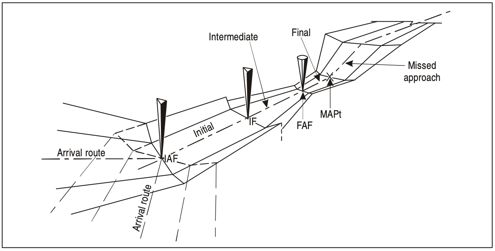
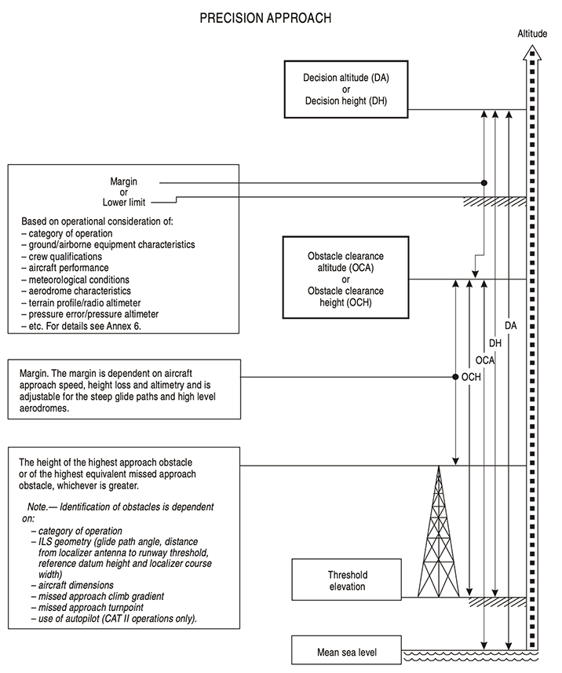
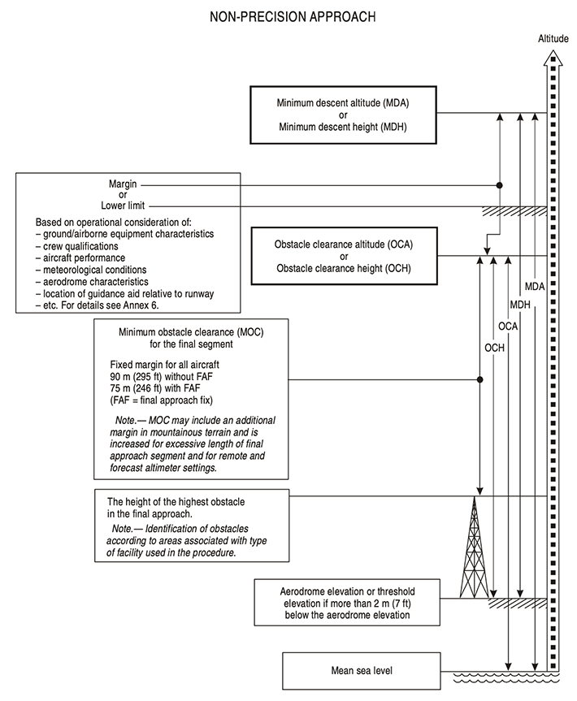
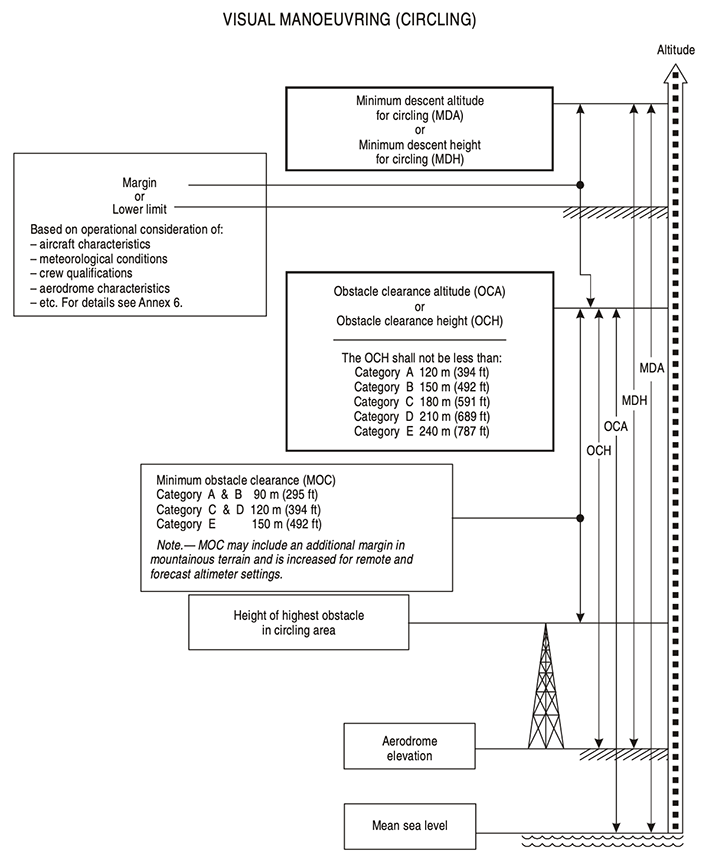

### ARRIVAL AND APPROACH PROCEDURES (General criteria)

#### 1. Instrument Approach Procedure

**The design of an instrument approach procedure** is, in general, **dictated** by the terrain surrounding the aerodrome, the type of operations contemplated and the aircraft to be accommodated. These factors in turn influence the type and siting of navigation aids in relation to the runway or aerodrome. Airspace restrictions may also affect the siting of navigation aids.

An instrument approach procedure may have five separate segments. They are the arrival, initial, intermediate, final and missed approach segments. See Figure 1.

*Fig.1 - Segments of instrument approach*

The approach segments begin and end at designated fixes. However, under some circumstances certain of the segments may begin at specified points where no fixes are available. For example, the final approach segment of a precision approach may start where the intermediate flight altitude intersects the nominal glide path (the final approach point).

**There are two types of approach:** straight-in and circling.

* Straight-in approach

Wherever possible, a straight-in approach will be specified which is aligned with the runway centre line. In the case of non-precision approaches, a straight-in approach is considered acceptable if the angle between the final approach track and the runway centre line is 30° or less.

* Circling approach

A circling approach will be specified in those cases where terrain or other constraints cause the final approach track alignment or descent gradient to fall outside the criteria for a straight-in approach. The final approach track of a circling approach procedure is in most cases aligned to pass over some portion of the usable landing surface of the aerodrome.

#### 2. Categories of aircraft

Aircraft performance has a direct effect on the airspace and visibility required for the various manoeuvres associated with the conduct of instrument approach procedures. The most significant performance factor is aircraft speed.

Accordingly, categories of typical aircraft have been established. These categories provide a standardized basis for relating aircraft manoeuvrability to specific instrument approach procedures. For precision approach procedures, the dimensions of the aircraft are also a factor for the calculation of the obstacle clearance height (OCH). For Category DL aircraft, an additional obstacle clearance altitude/height (OCA/H) is provided, when necessary, to take into account the specific dimensions of these aircraft.

The criterion taken into consideration for the classification of aeroplanes by categories is the indicated airspeed at threshold (Vat), which is equal to the stall speed **Vso** multiplied by 1.3, or stall speed **Vs1g** multiplied by 1.23 in the landing configuration at the maximum certificated landing mass. If both **Vso** and **Vs1g** are available, the higher resulting Vat shall be applied.

The landing configuration that is to be taken into consideration shall be defined by the operator or by the aeroplane manufacturer.

Aircraft categories will be referred to throughout this document by their letter designations as follows:

| Category      | Speed                                                        |
| :------------ | :----------------------------------------------------------- |
| *Category A:* | less than 169 km/h (91 kt) indicated airspeed (IAS)          |
| *Category B:* | 169 km/h (91 kt) or more but less than 224 km/h (121 kt) IAS |
| *Category C:* | 224 km/h (121 kt) or more but less than 261 km/h (141 kt) IAS |
| *Category D:* | 261 km/h (141 kt) or more but less than 307 km/h (166 kt) IAS |
| *Category E:* | 307 km/h (166 kt) or more but less than 391 km/h (211 kt) IAS |
| *Category H:* | see Helicopters                                              |

**Permanent change of category (maximum landing mass).** An operator may impose a permanent lower landing mass, and use of this mass for determining Vat if approved by the State of the Operator. The category defined for a given aeroplane shall be a permanent value and thus independent of changing day-to-day operations.

**The instrument approach chart (IAC)** will specify the individual categories of aircraft for which the procedure is approved. Normally, procedures will be designed to provide protected airspace and obstacle clearance for aircraft up to and including Category D. However, where airspace requirements are critical, procedures may be restricted to lower speed categories.

Alternatively, the procedure may specify a **maximum IAS for a particular segment** without reference to aircraft category. In any case, it is essential that pilots comply with the procedures and information depicted on instrument flight charts and the appropriate flight parameters if the aircraft is to remain in the areas developed for obstacle clearance purposes.

#### 3. Obstacle clearance

Obstacle clearance is a primary safety consideration in the development of instrument approach procedures. The criteria used and the detailed method of calculation are covered in PANS-OPS, Volume II. However, from the operational point of view, it is stressed that the obstacle clearance applied in the development of each instrument approach procedure is considered to be the minimum required for an acceptable level of safety in operations.

#### 4. Obstacle clearance height/altitude (OCH/A)

For each individual approach procedure an obstacle clearance altitude/height (OCA/H) is calculated in the development of the procedure and published on the instrument approach chart. In the case of precision approach and circling approach procedures, an OCA/H is specified for each category of aircraft listed in 2. **Obstacle clearance altitude/height (OCA/H) is:**

- **in a precision approach procedure**, the lowest altitude (OCA) or alternatively the lowest height above the elevation of the relevant runway threshold (OCH), at which a missed approach must be initiated to ensure compliance with the appropriate obstacle clearance criteria; or
- **in a non-precision approach procedure**, the lowest altitude (OCA) or alternatively the lowest height above aerodrome elevation or the elevation of the relevant runway threshold, if the threshold elevation is more than 2 m (7 ft) below the aerodrome elevation (OCH), below which an aircraft cannot descend without infringing the appropriate obstacle clearance criteria; or
- **in a visual (circling) procedure**, the lowest altitude (OCA) or alternatively the lowest height above the aerodrome elevation (OCH) below which an aircraft cannot descend without infringing the appropriate obstacle clearance criteria.

#### 5. Factors affecting operational minima

In general, minima are developed by adding the effect of a number of operational factors to OCA/H to produce, in the case of precision approaches, decision altitude (DA) or decision height (DH) and, in the case of non- precision approaches, minimum descent altitude (MDA) or minimum descent height (MDH). The general operational factors to be considered are specified in Annex 6. The relationship of OCA/H to operating minima (landing) is shown in Figures 2, 3, 4.

*Fig. 2 - Relationship of obstacle clearance altitude/height (OCA/H) to decision altitude/height (DA/H) for precision approaches.*

*Fig. 3 - Relationship of obstacle clearance altitude/height (OCA/H) to minimum descent altitude/height (MDA/H) for non-precision approaches (example with a controlling obstacle in the final approach)*.

*Fig. 4 - Relationship of obstacle clearance altitude/height (OCA/H) to minimum descent altitude/height (MDA/H) for visual manoeuvring (circling)*.

Operators may specify two types of approach procedures for non-precision approaches. The first is that described as: “descend immediately to not below the minimum stepdown fix altitude/height or MDA/H as appropriate”. This method is acceptable as long as the achieved descent gradient remains below 15 per cent and the missed approach is initiated at or before the MAPt. Alternatively, operators are encouraged to use a stabilized approach technique for non-precision approaches. This technique requires a continuous descent with a rate of descent adjusted to achieve a constant descent gradient to a point 15 m (50 ft) above threshold, taking due regard of the minimum crossing altitudes/heights specified for the FAF and any prescribed stepdown fix. If the required visual reference approaching MDA/H is not achieved, or if the MAPt is reached before reaching the MDA/H, the missed approach must be initiated. In either case, aircraft are not permitted to go below the MDA/H at any time. The stabilized approach technique is also associated with operator-specified limits of speed, power, configuration and displacement at (a) specified height(s) designed to ensure the stability of the approach path and a requirement for an immediate go-around if these requirements are not met.

***Note 1.*** *To achieve a constant descent gradient where stepdown fixes are specified, descent may be delayed until after passing the FAF, or the FAF crossed at an increased altitude/height.*

***Note 2.*** *When using the* *stabilized approach* *technique in a non-precision approach, the altitude/height at which the missed approach manoeuvre is initiated is a matter of pilot judgement based on the prevailing conditions and the overriding requirement to remain above the MDA/H. Where an operator specifies an advisory initiation altitude/height (above MDA/H) based on average conditions, the associated visibility requirements should be based on the MDA/H and not the advisory altitude/height.*

***Note 3.** In all cases, regardless of the flight technique used, cold temperature correction must be applied to all minimum altitudes .*

#### 6. Descend gradient

In instrument approach procedure design, adequate space is allowed for descent from the facility crossing altitude/height to the runway threshold for straight-in approach or to OCA/H for circling approaches.

Adequate space for descent is provided by establishing a maximum allowable descent gradient for each segment of the procedure. The minimum/optimum descent gradient/angle in the final approach of a procedure with FAF is 5.2 per cent/3.0° (52 m/km (318 ft/NM)). Where a steeper descent gradient is necessary, the maximum permissible is 6.5 per cent/3.7° (65 m/km (395 ft/NM)) for Category A and B aircraft, 6.1 per cent/3.5° (61 m/km (370 ft/NM)) for Category C, D and E aircraft, and 10 per cent (5.7°) for Category H. For procedures with VOR or NDB on aerodrome and no FAF, rates of descent in the final approach phase are given in Table 1 below. In the case of a precision approach, the operationally preferred glide path angle is 3.0° as specified in Annex 10, Volume I. An ILS glide path/MLS elevation angle in excess of 3.0° is used only where alternate means available to satisfy obstacle clearance requirements are impractical.

| Aircraft categories | Minimum                | Maximum                  |
| ------------------- | ---------------------- | ------------------------ |
| A, B                | 120 m/min (394 ft/min) | 200 m/min (655 ft/min)   |
| C, D, E             | 180 m/min (590 ft/min) | 305 m/min (1 000 ft/min) |

*Table 1 - Rate of descent in the final approach segment of a procedure with no FAF.*

In certain cases, the maximum descent gradient of 6.5 per cent (65 m/km (395 ft/NM)) results in descent rates which exceed the recommended rates of descent for some aircraft. For example, at 280 km/h (150 kt), such a gradient results in a 5 m/s (1 000 ft/min) rate of descent.

Pilots should consider carefully the descent rate required for non-precision final approach segments before starting the approach.

Any constant descent angle shall clear all stepdown fix minimum crossing altitudes within any segment.

In addition to minimum IFR altitudes established for each segment of the procedure, procedure altitudes/heights will also be provided. **Procedure altitudes/heights** will, in all cases, be at or above any minimum crossing altitude associated with the segment. Procedure altitude/height will be established taking into account the air traffic control needs for that phase of flight.

**Procedure altitudes/heights** are developed to place the aircraft at altitudes/heights that would normally be flown to intercept and fly an optimum 5.2 per cent (3.0°) descent path angle in the final approach segment to a 15 m (50 ft) threshold crossing for non-precision approach procedures and procedures with vertical guidance. In no case will a procedure altitude/height be less than any OCA/H.

