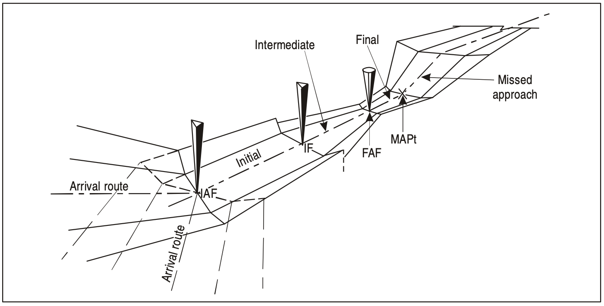
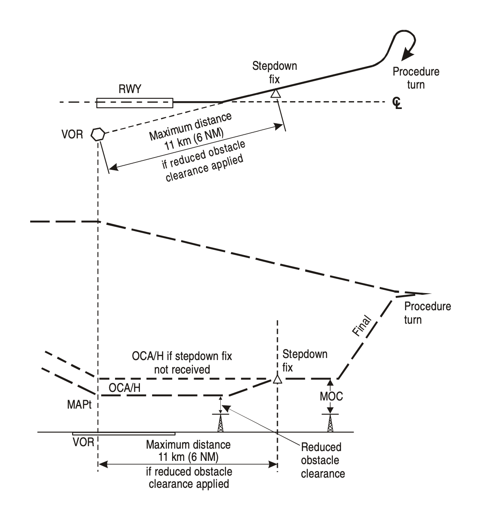

### FINAL APPROACH SEGMENT

#### 1. General

This is the segment in which alignment and descent for landing are made. Final approach may be made to a runway for a straight-in landing, or to an aerodrome for a visual manoeuvre.

The criteria for final approach vary according to the type. **These types are:**

1. Non-precision approach (NPA) with final approach fix (FAF);
2. NPA without FAF;
3. Approach with vertical guidance (APV); and
4. Precision approach (PA).

#### 2. NPA with FAF

This segment begins at a facility or fix, called the **final approach fix (FAF)** and ends at the missed approach point (MAPt) (see Figure 1). The FAF is sited on the final approach track at a distance that permits selection of final approach configuration, and descent from intermediate approach altitude/height to the appropriate MDA/H either for a straight-in approach or for a visual circling. The optimum distance for locating the FAF relative to the threshold is 9.3 km (5.0 NM). The maximum length should not normally be greater than 19 km (10 NM).

*Fig.1 - Segments of instrument approach* 

Compatible with the primary safety consideration of obstacle clearance, a non-precision approach provides the **optimum final approach descent gradient** of 5.2 per cent, or 3°, providing a rate of descent of 52 m per km (318 ft per NM).

“FAF crossing”, information provided in approach charts displays the optimum constant approach slope.

Operators shall include in their **SOPs** specific guidance for using on-board technology with ground-based aids, such as distance measuring equipment (DME), in order to facilitate the execution of optimum constant approach slope descents during non-precision approaches.

**The FAF is crossed** at the procedure altitude/height in descent but no lower than the minimum crossing altitude associated with FAF under international standard atmosphere (ISA) conditions. The descent is normally initiated prior to the FAF in order to achieve the prescribed descent gradient/angle. Delaying the descent until reaching the FAF at the procedure altitude/height will cause a descent gradient/angle to be greater than 3°. The descent gradient/angle is published to the nearest one-tenth of a degree for chart presentation and to the nearest one-hundredth of a degree for database coding purposes. Where range information is available, descent profile information is provided.

**A stepdown fix** may be incorporated in some non-precision approach procedures. In this case, two OCA/H values are published:

- a higher value applicable to the primary procedure; and
- a lower value applicable only if the stepdown fix is positively identified during the approach (see Figure 2).

*Fig. 2 - Stepdown fix* 

Normally only one stepdown fix is specified. However, in the case of a VOR/DME procedure several DME fixes may be depicted, each with its associated minimum crossing altitude.

Procedure design caters to a maximum final approach flight descent path after the fix of 15 per cent (Category H, 15 per cent or descent gradient of the nominal track multiplied by 2.5, whichever is greater).

Where a stepdown procedure using a suitably located DME is published, the pilot shall not begin descent until established on the specified track. Once established on track, the pilot shall begin descent while maintaining the aeroplane at or above the published DME distance/height requirements.

*Note.— The use of DME distance provides an additional check for en-route radar descent distances.*

#### 3. NPA without FAF

Sometimes an aerodrome is served by a single facility located on or near the aerodrome, and no other facility is suitably situated to form a FAF. In this case, a procedure may be designed where the facility is both the IAF and the MAPt.

These procedures indicate:

1. a minimum altitude/height for a reversal procedure or racetrack; and
2. an OCA/H for final approach.

In the absence of a FAF, descent to MDA/H is made once the aircraft is established inbound on the final approach track. Procedure altitudes/heights will not be developed for non-precision approach procedures without a FAF.

In procedures of this type, the final approach track cannot normally be aligned on the runway centre line. Whether OCA/H for straight-in approach limits are published or not depends on the angular difference between the track and the runway and position of the track with respect to the runway threshold.

#### 4. Precision approach

The final approach segment begins at the **final approach point (FAP)**. This is a point in space on the final approach track where the intermediate approach altitude/height intercepts the nominal glide path/microwave landing system (MLS) elevation angle.

The intermediate approach altitude/height generally intercepts the glide path/MLS elevation angle at heights from 300 m (1 000 ft) to 900 m (3 000 ft) above runway elevation. In this case, for a 3° glide path, interception occurs **between 6 km (3 NM) and 19 km (10 NM)** from the threshold.

The intermediate approach track or radar vector is designed to place the aircraft on the localizer or the MLS azimuth specified for the final approach track at an altitude/height that is below the nominal glide path/MLS elevation angle.

The final approach area contains a fix or facility that permits verification of the glide path/MLS elevation angle/altimeter relationship. **The outer marker** or equivalent **DME fix** is normally used for this purpose. Prior to crossing the fix, descent may be made on the glide path/MLS elevation angle to the altitude/height of the published fix crossing.

Descent below the fix crossing altitude/height should not be made prior to crossing the fix.

It is assumed that the aircraft altimeter reading on crossing the fix is correlated with the published altitude, allowing for altitude error and altimeter tolerances.

*Note.— Pressure altimeters are calibrated to indicate true altitude under ISA conditions. Any deviation from ISA will therefore result in an erroneous reading on the altimeter. If the temperature is higher than ISA, then the true altitude will be higher than the figure indicated by the altimeter. Similarly, the true altitude will be lower when the temperature is lower than ISA. The altimeter error may be significant in extremely cold temperatures.*

In the event of loss of glide path/MLS elevation angle guidance during the approach, the procedure becomes a non-precision approach. The OCA/H and associated procedure published for the glide path/MLS elevation angle inoperative case will then apply.

#### 5. Determination of descision altitude (DA) or descision height (DH)

In addition to the physical characteristics of the ILS/MLS/GBAS installation, the procedures specialist considers obstacles both in the approach and in the missed approach areas in the calculation of the OCA/H for a procedure. The calculated OCA/H is the height of the highest approach obstacle or equivalent missed approach obstacle, plus an aircraft category related allowance.

In assessing these obstacles, the operational variables of the aircraft category, approach coupling, category of operation and missed approach climb performance are considered. The OCA/H values, as appropriate, are promulgated on the instrument approach chart for those categories of aircraft for which the procedure is designed. OCA/H values are based on the standard conditions (among others) listed in the sub-paragraphs that follow.

*Aircraft dimensions:* See Table 1.

*ILS:*

1. Category I flown with pressure altimeter;

2. Category II flown with radio altimeter and flight director;

3. missed approach climb gradient is 2.5 per cent; and

4. glide path angle:

   -minimum: 2.5°

   -optimum: 3.0°

   -maximum: 3.5° (3° for Category II/III operations).

*MLS:*

1. Category I flown with pressure altimeter;

2. Category II flown autocoupled/flight director, with radio altimeter;

3. missed approach climb gradient is 2.5 per cent; and d) elevation angle:

   -minimum: 2.5°

   -optimum: 3.0°

   -maximum: 3.5° (3° for Category II/III operations).

Additional values of OCA/H may be promulgated to cater for specific aircraft dimensions, improved missed approach performance and use of autopilot in Category II approach when applicable.

Additional factors listed, including those in Annex 6, are considered by the operator and are applied to the OCA/H. This results in the DA/H value.

| *Aircraft category* | *Wing span, (m)* | *Vertical distance between the flight paths of the wheels and the GP antenna, (m)* |
| :-----------------: | :--------------: | :----------------------------------------------------------: |
|          H          |        30        |                              3                               |
|         A,B         |        60        |                              6                               |
|         C,D         |        65        |                              7                               |
|         Dl          |        80        |                              8                               |

Table 1. - Aircraft dimensions

*Note.— OCA/H for Dl aircraft is published when necessary.*

​		**Non-standard procedures** are those involving glide paths greater than 3.5° or any angle when the nominal rate of descent exceeds 5 m/sec (1 000 ft/min). Procedure design takes into account:

1. a)  increase of height loss margin (which may be aircraft-type specific);
2. b)  adjustment of the protection surfaces;
3. c)  re-survey of obstacles; and
4. d)  the application of related operational constraints.

Non-standard procedures are normally restricted to specifically approved operators and aircraft, and are promulgated with appropriate aircraft and crew restrictions annotated on the approach chart. They are not to be used as a means to introduce noise abatement procedures.

The height loss/altimeter margin should be verified by certification or flight trials to cover the effects of minimum drag configuration, wind shear, control laws, handling characteristics, minimum power for anti-icing, GPWS modification, use of flight director/autopilot, engine spin-up time and Vat increase for handling considerations.

In addition, consideration should have been given to operational factors including configuration, engine- out operation, maximum tailwind/minimum headwind limits, weather minima, visual aids and crew qualifications, etc.

The width of the ILS/MLS/GBAS **final approach protection area** is much narrower than those of non-precision approaches. Descent on the glide path/MLS elevation angle must never be initiated until the aircraft is within the tracking tolerance of the localizer/azimuth.

The protection area assumes that the pilot does not normally deviate from the centre line more than half- scale deflection after being established on track. Thereafter the aircraft should adhere to the on-course, on-glide path/elevation angle position since a more than half course sector deflection or a more than half course fly-up deflection combined with other allowable system tolerances could place the aircraft in the vicinity of the edge or bottom of the protected airspace where loss of protection from obstacles can occur.

Operators must consider weight, altitude and temperature limitations and wind velocity when determining the DA/H for a missed approach, since the OCA/H might be based on an obstacle in the missed approach area and since advantage may be taken of variable missed approach climb performances.

Unless otherwise noted on the instrument approach chart, the nominal missed approach climb gradient is 2.5 per cent.

Table 2, 3 show the allowance used by the procedures specialist for vertical displacement during initiation of a missed approach. It takes into account type of altimeter used and the height loss due to aircraft characteristics.

It should be recognized that no allowance has been included in the table for any abnormal meteorological conditions; for example, wind shear and turbulence.

| *Aircraft category (V**at**)* | *Meters* | *Feet* |
| :---------------------------: | :------: | :----: |
|     A — 169 km/h (90 kt)      |    13    |   42   |
|     B — 223 km/h (120 kt)     |    18    |   59   |
|     C — 260 km/h (140 kt)     |    22    |   71   |
|     D — 306 km/h (165 kt)     |    26    |   85   |

*Table 2 - Height loss/altimeter margin using radio altimeter*

| *Aircraft category (V**at**)* | *Meters* | *Feet* |
| :---------------------------: | :------: | :----: |
|     A — 169 km/h (90 kt)      |    40    |  130   |
|     B — 223 km/h (120 kt)     |    43    |  142   |
|     C — 260 km/h (140 kt)     |    46    |  150   |
|     D — 306 km/h (165 kt)     |    49    |  161   |

*Table 3 - Height loss/altimeter margin using pressure altimeter*

