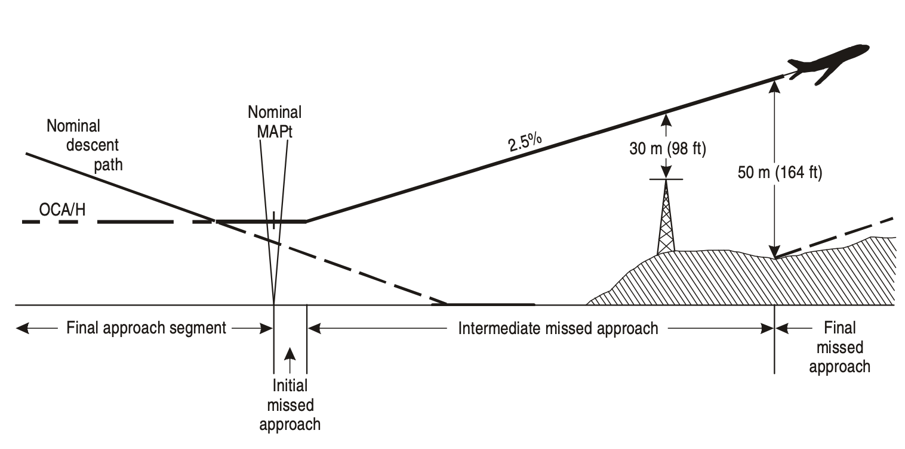

### MISSED APPROACH SEGMENT

#### 1. General

During the missed approach phase of the instrument approach procedure, the pilot is faced with the demanding task of changing the aircraft configuration, attitude and altitude. For this reason, the design of the missed approach has been kept as simple as possible and consists of three phases (initial, intermediate and final). See Figure 1.

*Fig. 1 - Missed approach phases*

Only one missed approach procedure is established for each instrument approach procedure. It is designed to provide protection from obstacles throughout the missed approach manoeuvre. It specifies a point where the missed approach begins, and a point or an altitude/height where it ends.

The missed approach should be initiated not lower than the decision altitude/height (DA/H) in precision approach procedures, or at a specified point in non-precision approach procedures not lower than the minimum descent altitude/height (MDA/H).

It is expected that the pilot will fly the missed approach procedure as published. If a missed approach is initiated before arriving at the missed approach point (MAPt), the pilot will normally proceed to the MAPt (or to the middle marker fix or specified DME distance for precision approach procedures) and then follow the missed approach procedure in order to remain within the protected airspace.

*Note 1.— This does not preclude flying over the MAPt at an altitude/height greater than that required by the procedure.*

*Note 2.— In the case of a missed approach with a turn at an altitude/height, when an operational need exists, an additional protection is provided for the safeguarding of early turns. When it is not possible, a note is published on the profile view of the approach chart to specify that turns must not commence before the MAPt (or before an equivalent point in the case of a precision approach).*

The MAPt in a procedure may be defined by:

- The point of intersection of an electronic glide path with the applicable DA/H in APV or precision approaches; or
- A navigation facility, a fix, or a specified distance from the final approach fix (FAF) in non-precision approaches.

When the MAPt is defined by a navigation facility or a fix, the distance from the FAF to the MAPt is normally published as well, and may be used for timing to the MAPt. In all cases where timing may not be used, the procedure is annotated “timing not authorized for defining the MAPt”.

*Note.— Timing from the FAF based on ground speed may also be used to assist the planning of a stabilized approach.*

If upon reaching the MAPt the required visual reference is not established, the procedure requires that a missed approach be initiated at once in order to maintain protection from obstacles.

Normally procedures are based on a minimum **missed approach climb gradient** of 2.5 per cent. A gradient of 2 per cent may be used in the procedure construction if the necessary survey and safeguarding have been provided. With the approval of the appropriate authority, gradients of 3, 4 or 5 per cent may be used for aircraft whose climb performance permits an operational advantage to be thus obtained.

When a gradient other than 2.5 per cent is used, this is indicated on the instrument approach chart. In addition to the OCA/H for this gradient, the OCA/H applicable to the nominal gradient will also be shown.

*Special conditions.* It is emphasized that a missed approach procedure which is based on the nominal climb gradient of 2.5 per cent cannot be used by all aeroplanes when operating at or near maximum certificated gross mass and engine-out conditions. The operation of aeroplanes under these conditions needs special consideration at aerodromes which are critical due to obstacles on the missed approach area. This may result in a special procedure being established with a possible increase in the DA/H or MDA/H.

#### 2. Initial phase

The initial phase begins at the MAPt and ends at the start of climb (SOC). This phase requires the concentrated attention of the pilot on establishing the climb and the changes in aeroplane configuration. It is assumed that guidance equipment is not extensively utilized during these manoeuvres, and for this reason, no turns are specified in this phase.

#### 3. Intermediate phase

The intermediate phase begins at the SOC. The climb is continued, normally straight ahead. It extends to the first point where 50 m (164 ft) obstacle clearance is obtained and can be maintained.

The intermediate missed approach track may be changed by a maximum of 15° from that of the initial missed approach phase. During this phase, it is assumed that the aircraft begins track corrections.

#### 4. Final phase

The final phase begins at the point where 50 m (164 ft) obstacle clearance is first obtained (for Category H procedures, 40 m (131 ft)) and can be maintained. It extends to the point where a new approach, holding or a return to en-route flight is initiated. Turns may be prescribed in this phase.

**Turns in a missed approach procedure** are only prescribed where terrain or other factors make a turn necessary.

If a turn from the final approach track is made, a specially constructed turning missed approach area is specified.

The protected airspace for turns is based on the **speeds for final missed approach** (see Tables 1 and 2).

| *Aircraft category* | *V*(at) | *Range of speeds for initial approach* | *Range of final approach speeds* | *Maximum speeds for visual manoeuvring (circling)* | *Maximum speeds for missed approach* (*intermediate/final*) |
| :-----------------: | :-----: | :------------------------------------: | :------------------------------: | :------------------------------------------------: | :---------------------------------------------------------: |
|          A          |  <169   |             165/280(205*)              |             130/185              |                        185                         |                           185/205                           |
|          B          | 169/223 |             220/335(260*)              |             155/240              |                        250                         |                           240/280                           |
|          C          | 224/260 |                295/445                 |             215/295              |                        335                         |                           295/445                           |
|          D          | 261/306 |                345/465                 |             240/345              |                        380                         |                           345/490                           |
|          E          | 307/390 |                345/467                 |             285/425              |                        445                         |                           425/510                           |
|          H          |   N/A   |               130/220**                |            110/165***            |                        N/A                         |                           165/165                           |
|    CAT (PinS)***    |   N/A   |                130/220                 |             110/165              |                        N/A                         |                   130 or 165 / 130 or 165                   |

*Table 1 - Speeds for procedure calculations in kilometres per hour (km/h)*

Vat — Speed at threshold based on 1.3 times stall speed Vso or 1.23 times stall speed Vs1g in the landing configuration at maximum certificated landing mass. (Not applicable to helicopters.)

\*Maximum speed for reversal and racetrack procedures.

**Maximum speed for reversal and racetrack procedures up to and including 6 000 ft is 185 km/h, and maximum speed for reversal and racetrack procedures above 6 000 ft is 205 km/h.

***Helicopter point-in-space procedures based on basic GNSS may be designed using maximum speeds of 220 km/h for initial and intermediate segments and 165 km/h on final and missed approach segments, or 165 km/h for initial and intermediate segments and 130 km/h on final and missed approach segments based on operational need. 

*Note.* *The Vat speeds given in Column 1 of this table are converted exactly from those in Table 2, since they determine the category of aircraft. The speeds given in the remaining columns are converted and rounded to the nearest multiple of five for operational reasons and from the standpoint of operational safety are considered to be equivalent.*

| *Aircraft category* | *V*(at) | *Range of speeds for initial approach* | *Range of final approach speeds* | *Maximum speeds for visual manoeuvring (circling)* | *Maximum speeds for missed approach* (*intermediate/final*) |
| :-----------------: | :-----: | :------------------------------------: | :------------------------------: | :------------------------------------------------: | :---------------------------------------------------------: |
|          A          |   <91   |              90/150(110*)              |              70/100              |                        100                         |                           100/110                           |
|          B          | 91/120  |             120/180(140*)              |              85/130              |                        135                         |                           130/150                           |
|          C          | 121/140 |                160/240                 |             115/160              |                        180                         |                           160/240                           |
|          D          | 141/165 |                185/250                 |             130/185              |                        205                         |                           185/265                           |
|          E          | 166/210 |                185/250                 |             155/230              |                        240                         |                           230/275                           |
|          H          |   N/A   |                70/120**                |             60/90***             |                        N/A                         |                            90/90                            |
|    CAT (PinS)***    |   N/A   |                 70/120                 |              60/90               |                        N/A                         |                     70 or 90 / 70 or 90                     |

*Table 2 - Speeds for procedure calculations in knots (kts)*

Vat — Speed at threshold based on 1.3 times stall speed Vso or 1.23 times stall speed Vs1g in the landing configuration at maximum certificated landing mass. (Not applicable to helicopters.)

\*Maximum speed for reversal and racetrack procedures.

**Maximum speed for reversal and racetrack procedures up to and including 6 000 ft is 100 kt, and maximum speed for reversal and racetrack procedures above 6 000 ft is 110 kt.

***Helicopter point-in-space procedures based on basic GNSS may be designed using maximum speeds of 120 KIAS for initial and intermediate segments and 90 KIAS on final and missed approach segments, or 90 KIAS for initial and intermediate segments and 70 KIAS on final and missed approach segments based on operational need. 

*Note.* *The Vat speeds given in Column 1 of Table 1 are converted exactly from those in this table, since they determine the category of aircraft. The speeds given in the remaining columns are converted and rounded to the nearest multiple of five for operational reasons and from the standpoint of operational safety are considered to be equivalent.*

However, where operationally required to avoid obstacles, the IAS as slow as for *intermediate missed approach* may be used. In this case, the instrument approach chart contains the following note: **“Missed approach turn limited to ___ km/h (kt) IAS maximum”.**

In addition, where an obstacle is located early in the missed approach procedure, the instrument approach chart is annotated **“Missed approach turn as soon as operationally practicable to ___ heading”.**

*Note.— Flight personnel are expected to comply with such annotations on approach charts and to execute the appropriate manoeuvres without undue delay.*