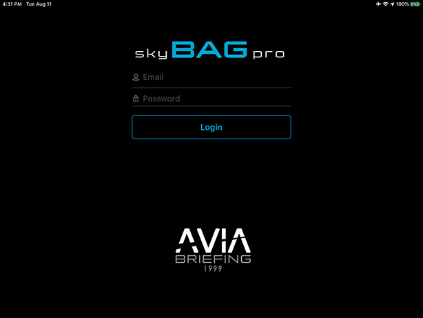
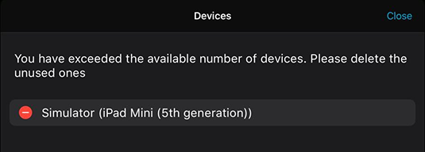

### 2. Первый запуск приложения, вход

Нажмите на ярлык приложения, расположенный на рабочем столе устройства.

**ВНИМАНИЕ! **На данном этапе необходимо соединение с сетью интернет.

Если у вас уже имеется учетная запись, то введите ваш логин в поле «USER» и ваш пароль в поле «PASSWORD», затем нажмите кнопку «LOGIN».

**ВНИМАНИЕ! **В целях защиты от несанкционированного распространения, количество привязанных к учетной записи устройств ограничено.

При входе с нового устройства и превышении лимита по количеству зарегистрированных устройств учетной записи появляется окно «Devices», где отображается список устройств.

Чтобы продолжить вход необходимо отвязать неиспользуемые устройства.

Для отвязки устройства от учетной записи нажмите на кнопку , после чего удалите устройство и нажмите кнопку «Close».
