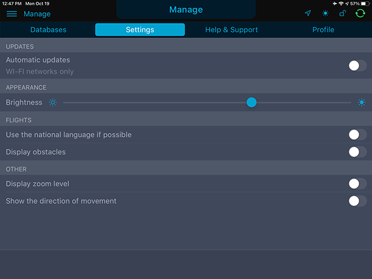

### 4. Настройки приложения

Для управления настройками приложения перейдите в раздел «Manage». В появившемся окне выберите вкладку «Settings».

Пользователю доступны следующие настройки:

- Управление автоматическим обновлением навигационных баз (при наличии соединения с сетью интернет через Wi-Fi)
- Настройка яркости экрана
- Использование национального языка (если функция доступна в разделе)
- Управление отображением препятствий
- Настройка отображения уровня приближения маршрутной карты в разделе "Flight"
- Отображение направления перемещения

