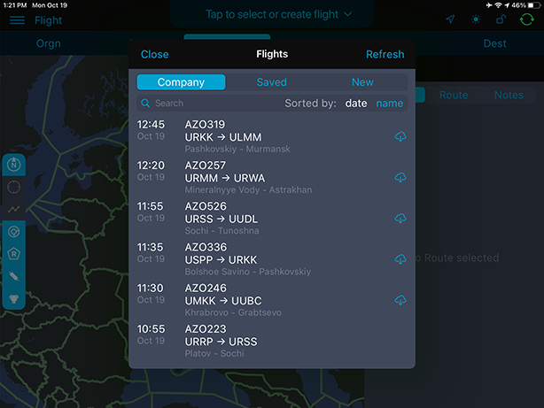

### 7. Выбор маршрута из списка маршрутов АК

Для того, чтобы выбрать маршрут из списка маршрутов авиакомпании необходимо перейти в раздел «Flight». Затем, в верхней части экрана нажать кнопку Tap to select or create flight.

В появившемся окне во вкладке «Company» доступны маршруты авиакомпании.

Выберите нужный маршрут, траектория полета отобразится на карте автоматически.

В панели справа доступна строка для удобного поиска в навигационной базе поворотных пунктов маршрута, воздушных трасс, зон с особым режимом полета, частей контролируемого воздушного пространства.

Также, в боковой панели доступны три вкладки:

- FPL
- Route 
- Notes

Во вкладке FPL отображены аэродромы вылета и назначения, маршрут полета и запасные аэродромы. Вы можете просмотреть маршрут, а также изменить аэродром следования. При нажатии на ППМ или ВТ во вкладке FPL, выбранный элемент будет подсвечен на карте.

Чтобы заменить аэродром следования необходимо нажать на синюю стрелку в правом нижнем углу. В появившемся окне найти нужный аэродром и нажать кнопку «Done».

Чтобы получить дополнительную информацию об аэродроме нажмите на синюю стрелку, расположенную справа от ИКАО кода - .

