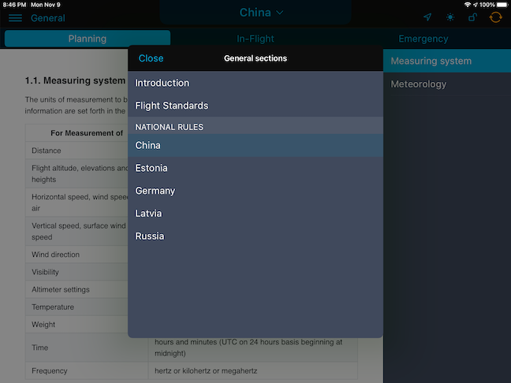

### 14. Справочная информация из раздела "General"

Справочная информация из раздела «General» содержит сведения об особенностях выполнения полетов в воздушном пространстве страны или региона, данные из авиационных стандартов и другую полезную информацию.

Чтобы перейти в раздел «General» выйдите в главное меню и нажмите на вкладку с соответствующим названием.

Переключение между подразделами осуществляется во всплывающем меню, которое можно открыть нажав на кнопку сверху.

В «General» доступно три секции, отражающие содержание раздела:

- Introduction
- Flight Standards
- National rules

