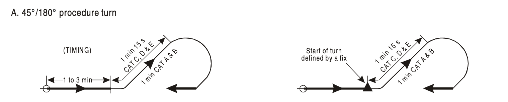
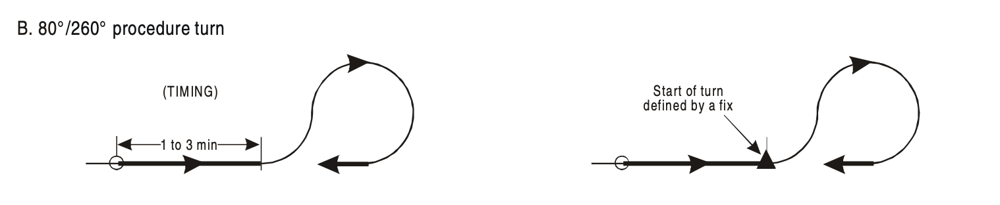
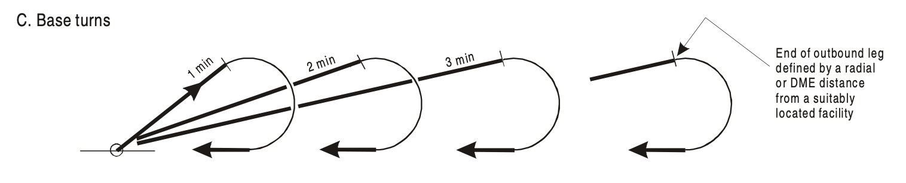
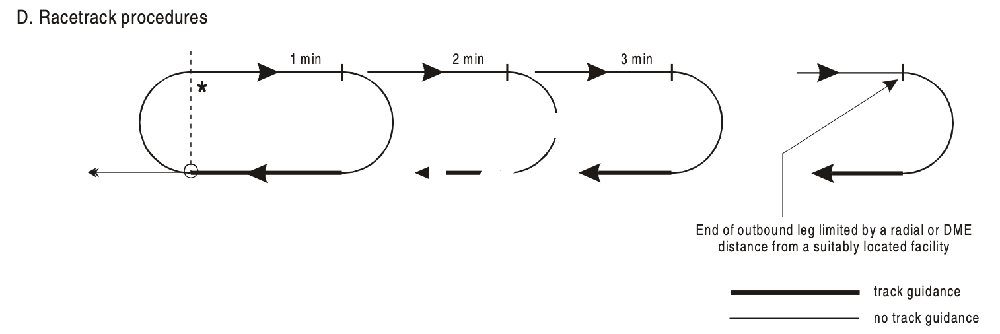
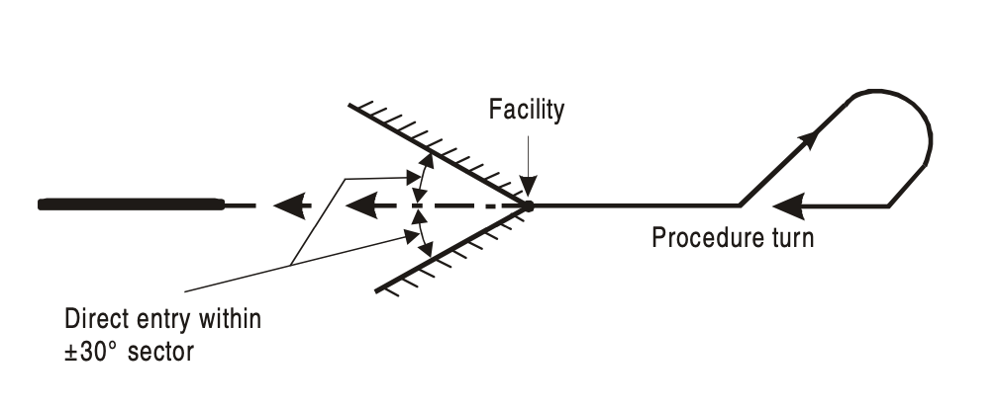
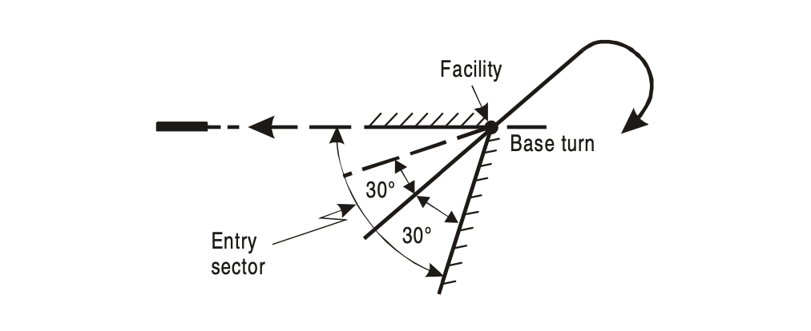
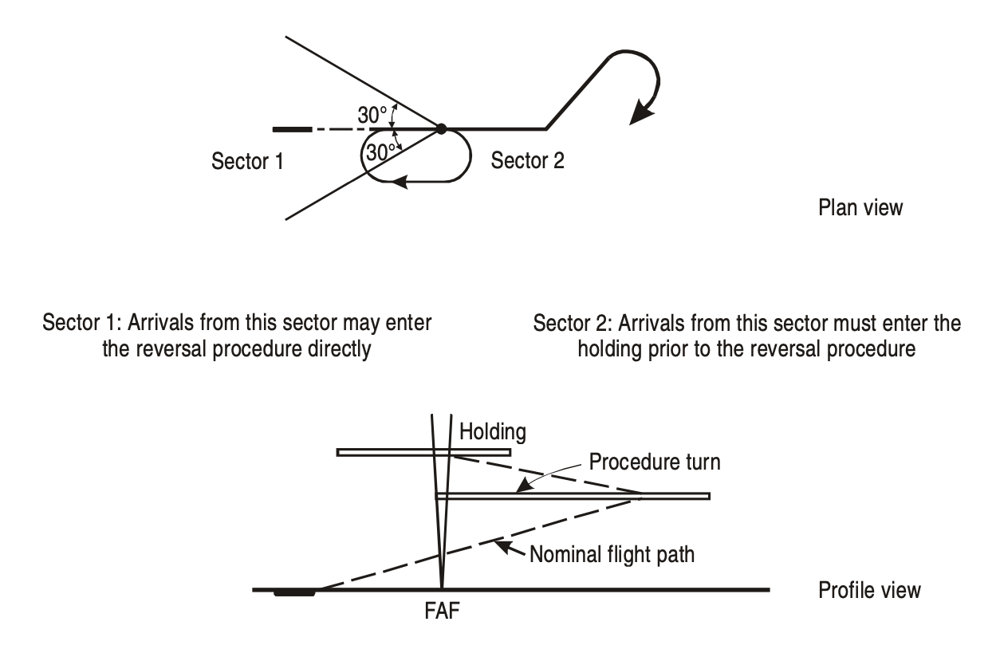
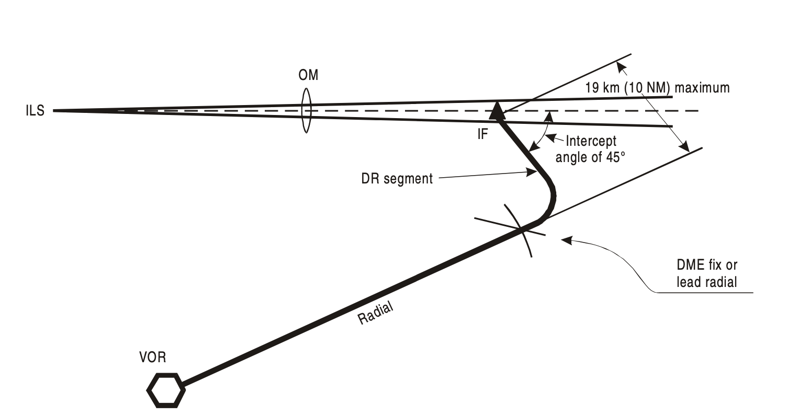

### INITIAL APPROACH SEGMENT

#### 1. General

The initial approach segment begins at the initial approach fix (IAF) and ends at the intermediate fix (IF). In the initial approach, the aircraft has left the en-route structure and is manoeuvring to enter the intermediate approach segment.

Aircraft speed and configuration will depend on the distance from the aerodrome, and the descent required.

Normally track guidance is provided along the initial approach segment to the IF, with **a maximum angle of interception of:**

a)  90° for a precision approach; and

b)  120° for a non-precision approach.

**The initial approach segment provides** at least 300 m (1 000 ft) of **obstacle clearance** in the primary area, reducing laterally to zero at the outer edge of the secondary area.

#### 2. Types of maneouvers

Where no suitable IAF or IF is available to construct the instrument procedure, a *reversal procedure*, *racetrack* or *holding pattern* is required.

**The reversal procedure** may be in the form of a procedure or base turn. Entry is restricted to a specific direction or sector. In these cases, a specific pattern — normally a base turn or procedure turn — is prescribed. The directions and timing specified should be strictly followed in order to remain within the airspace provided. It should be noted that the airspace provided for these procedures does not permit a racetrack or holding manoeuvre to be conducted unless so specified.

There are three generally recognized manoeuvres related to the reversal procedure, each with its own airspace characteristics:

*A) 45°/180° procedure turn (see Figure 1) starts at a facility or fix and consists of:*

- a straight leg with track guidance. This straight leg may be timed or may be limited by a radial or DME distance.
- a 45° turn;
- a straight leg without track guidance. This straight leg is timed. It is:
  - 1 minute from the start of the turn for Category A and B aircraft; and
  - 1 minute 15seconds from the start of the turn for Category C, D and E aircraft; and
- a 180° turn in the opposite direction to intercept the inbound track.

*The 45°/180° procedure turn is an alternative to the 80°/260° procedure turn [b) below] unless specifically excluded.*

*Fig. 1 - 45°/180° procedure turn*

*B) 80°/260° procedure turn (see Figure 2), starts at a facility or fix and consists of:*

- a straight leg with track guidance. This straight leg may be timed or may be limited by a radial or DME

  distance;

- an 80° turn;

- a 260° turn in the opposite direction to intercept the inbound track.

*The 80°/260° procedure turn is an alternative to the 45°/180° procedure turn [a) above] unless specifically excluded.*

*Note.— The duration of the initial outbound leg of a procedure may be varied in accordance with aircraft speed categories in order to reduce the overall length of the protected area. In this case, separate procedures are published.*

*Fig. 2 - 80° /260° procedure turn*

*C) Base turn, consisting of:*

- a specified outbound track and timing or DME distance from a facility; followed by
- a turn to intercept the inbound track (see Figure 3).

The outbound track and/or the timing may be different for the various categories of aircraft. Where this is done, separate procedures are published.

*Fig. 3 - Base turns* 

**A racetrack procedure** consists of:

- a turn from the inbound track through 180° from overhead the facility or fix on to the outbound track, for 1, 2 or 3 minutes; followed by
- a 180° turn in the same direction to return to the inbound track (see Figure 4).

As an alternative to timing, the outbound leg may be limited by a DME distance or intersecting radial/bearing.

*Fig. 4 - Racetrack procedures*

*Entry into a racetrack procedure*

Normally a racetrack procedure is used when aircraft arrive overhead the fix from various directions. In these cases, aircraft are expected to enter the procedure in a manner similar to that prescribed for a holding procedure entry with the following considerations:

1. Offset entry from Sector 2 shall limit the time on the 30° offset track to 1 min 30 s, after which the pilot is expected to turn to a heading parallel to the outbound track for the remainder of the outbound time. If the outbound time is only 1 min, the time on the 30° offset track shall be 1 min also;
2. Parallel entry shall not return directly to the facility without first intercepting the inbound track when proceeding to the final segment of the approach procedure; and
3. All manoeuvring shall be done in so far as possible on the manoeuvring side of the inbound track.

*Note.— Racetrack procedures are used where sufficient distance is not available in a straight segment to accommodate the required loss of altitude and when entry into a reversal procedure is not practical. They may also be specified as alternatives to reversal procedures to increase operational flexibility (in this case, they are not necessarily published separately).*

#### 3. Flight procedures for Racetrack and Reversal procedures

Unless the procedure specifies particular entry restrictions, **reversal procedures shall be entered** from a track within ±30° of the outbound track of the reversal procedure. However, for base turns, where the ±30° direct entry sector does not include the reciprocal of the inbound track, the entry sector is expanded to include it.

For racetrack procedures, entry shall be as specified in above, “*Entry into a racetrack procedure*”, unless other restrictions are specified. See Figures 5, 6 and 7.

*Fig. 5 - Direct entry to procedure turn*

*Fig. 6 - Direct entry to base turn*

*Fig. 7 - Example of omnidirectional arrival using a holding procedure in association with a reversal procedure*

**Speed restrictions** may be specified in addition to, or instead of, aircraft category restrictions. The speeds must not be exceeded to ensure that the aircraft remains within the limits of the protected areas.

Procedures are based on average achieved **bank angle** of 25°, or the bank angle giving a rate of turn of 3°/second, whichever is less.

The aircraft shall cross the fix or facility and fly outbound on the specified track, **descending** as necessary to the procedure altitude/height but no lower than the minimum crossing altitude/height associated with that segment. If a further descent is specified after the inbound turn, this descent shall not be started until the aircraft is established on the inbound track. An aircraft is considered established when it is:

1. Within half full scale deflection for the ILS and VOR; or
2. Within ±5° of the required bearing for the NDB.

When the racetrack procedure is based on a facility, the **outbound timing** starts:

1. From abeam the facility; or
2. On attaining the outbound heading,

whichever comes later.

When the racetrack procedure is based on a fix, the outbound timing starts from attaining the outbound heading.

The turn on to the inbound track should be started:

1. Within the specified time (adjusted for wind); or
2. When encountering any DME distance; or
3. When the radial/bearing specifying a limiting distance has been reached,

whichever occurs first.

To achieve a stabilized approach, due allowance should be made in both heading and timing to compensate for the **effects of wind** so that the aircraft regains the inbound track as accurately and expeditiously as possible. In making these corrections, full use should be made of the indications available from the aid and from estimated or known winds. 

When a DME distance or radial/bearing is specified, it shall not be exceeded when flying on the outbound track.

The specified timings and procedure altitudes are based on **rates of descent** that do not exceed the values shown in Table 1.

| Outbound track   | Maximum*                 | Minimum* |
| ---------------- | ------------------------ | -------- |
| Category A/B     | 245 m/min (804 ft/min)   | N/A      |
| Category C/D/E/H | 365 m/min (1 197 ft/min) | N/A      |

| Inbound track  | Maximum*                 | Minimum*               |
| -------------- | ------------------------ | ---------------------- |
| Category A/B   | 200 m/min (655 ft/min)   | 120 m/min (394 ft/min) |
| Category H     | 230 m/min (755 ft/min)   | N/A                    |
| Category C/D/E | 305 m/min (1 000 ft/min) | 180 m/min (590 ft/min) |

*Table 1 - Maximum/minimum descent rate to be specified on a reversal or racetrack procedure*

*Maximum/minimum descent for 1 minute nominal outbound time in m (ft).

**A shuttle** is normally prescribed where the descent required between the end of initial approach and the beginning of final approach exceeds the values shown in Table 1.

*Note.— A shuttle is descent or climb conducted in a holding pattern.*

Where an operational advantage can be obtained, an ILS procedure may include a **dead reckoning (DR)** segment from a fix to the localizer (see Figure 8). The DR track will intersect the localizer at 45° and will not be more than 19 km (10 NM) in length. The point of interception is the beginning of the intermediate segment and will allow for proper glide path interception.

*Fig. 8 - Dead reckoning segment*

